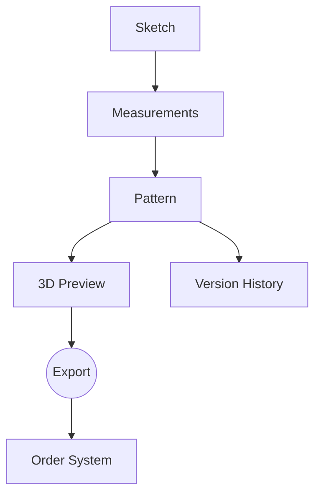

# garmentGeneration

Here's the enhanced workflow with data flow integration, showing how information propagates through each stage:

```markdown
# Fashion Design Web App - Workflow with Data Relationships

## 1. Home Page (`/`)
**Data Collected:**
- User authentication state (Firebase Auth)
- Recent projects list (Firestore query)

## 2. New Project Flow

### A. Sketching Interface (`/project/new/sketch`)
**Input Data:**
- Garment type selection (dropdown value)
- Freehand drawing (Fabric.js JSON)
   ```json
   {
     "objects": [{
       "type": "path",
       "path": "M 10 10 L 100 100",
       "stroke": "#000000"
     }],
     "background": "white"
   }
   ```
- Uploaded reference images (Base64 or S3 URL)

**Output Data:**
- Sketch JSON (stored in Firestore)
- Contour coordinates for pattern generation

---

### B. Measurements Input (`/project/new/measurements`)
**Input Data:**
1. Manual Input:
   ```javascript
   {
     "body": {
       "bust": 92, // cm
       "waist": 76,
       "hips": 98,
       "shoulderWidth": 40
     },
     "garment": {
       "length": 120,
       "sleeveLength": 60
     }
   }
   ```
2. 3D Scan Data (if enabled):
   - Point cloud data from webcam/AR
   - TensorFlow.js pose estimation

**Data Transformations:**
- Normalize measurements to pattern scales
- Flag measurement outliers (e.g., bust-waist ratio)

---

### C. Pattern Drafting (`/project/new/pattern`)
**Data Flow:**
1. Inputs:
   - Sketch contours (SVG paths)
   - Measurement object
   - Fabric properties (stretch %, drape)

2. Pattern Generation:
   ```javascript
   // OpenJSCAD example
   function main() {
     return union(
       skirtFront(sketch.contours, measurements.waist),
       dart(measurements.bust - measurements.waist)
     );
   }
   ```

**Output Data:**
- 2D Pattern pieces (SVG)
- Seam allowance calculations
- Notch positions

---

### D. Virtual Sewing (`/project/new/preview`)
**Data Integration:**
1. Inputs:
   - Pattern pieces (SVG)
   - Selected fabric physics properties:
     ```json
     {
       "weight": 140, // gsm
       "stretch": 15, // %
       "friction": 0.3
     }
     ```

2. 3D Simulation Process:
   - Flatten pattern → Three.js Cloth Simulation
   - Stress analysis:
     ```javascript
     const stressPoints = physicsEngine.calculateStress(
       mannequinModel, 
       garmentMesh
     );
     ```

**Output Data:**
- GLB 3D model
- Fit analysis report:
  ```json
  {
    "tightAreas": ["shoulders", "hips"],
    "ease": {
      "chest": 5, // cm excess
      "waist": 2
    }
  }
  ```

## 3. Output Generation (`/project/[id]/export`)
**Data Utilization:**
| Output Type | Data Sources | Transformation |
|-------------|--------------|----------------|
| PDF Pattern | Pattern SVG + User preferences (inch/cm) | SVG-to-PDF conversion |
| 3D OBJ File | Three.js scene graph | GLTFExporter |
| Order Sheet | Measurements + Fabric choice | CSV generation |

## 4. Project Management (`/projects`)
**Data Relationships:**


## Critical Data Handoffs
1. **Sketch → Pattern**:
   - Contour tracing algorithm extracts:
     - Key points (neckline, hem)
     - Symmetry detection

2. **Measurements → Pattern**:
   - Grading rules application:
     ```javascript
     function applyGrading(basePattern, measurements) {
       return basePattern.map(patternPiece => {
         return scalePiece(patternPiece, measurements);
       });
     }
     ```

3. **Pattern → 3D**:
   - Sewing simulation requires:
     - Stitch lines mapping
     - Fabric grain direction

## Data Validation Points
1. Sketch Phase:
   - Minimum detectable garment parts
   - Closed path verification

2. Measurements Phase:
   - Realistic body proportions check
   ```javascript
   if (bust - waist < 15cm) warn("Extreme hourglass");
   ```

3. Pattern Phase:
   - Seam length matching
   - Overlap detection
```

Would you like me to:
1. Add sample API payloads for each transition?
2. Detail the error handling for data mismatches?
3. Provide database schema relationships diagram?
4. Focus on any specific data transformation algorithm?
